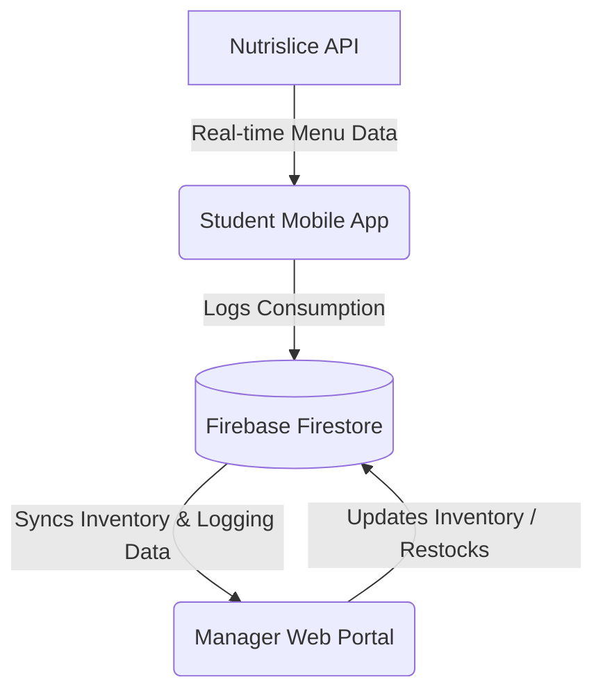

# DawgBite 🐾🍔

An intelligent dining companion and manager dashboard designed to optimize the UGA dining hall experience. DawgBite provides students with personalized, AI-powered meal recommendations (via Gemini) and real-time macronutrient logging, while giving dining service managers predictive restock tracking and analytics to prevent food shortages.

### Team Members
* **Kaushal Bevara**
* **Mohan Kamath**
* **Ethan Goes**
* **Nikheth Kanala**

---

## 🌟 Key Features

### For Students (Mobile App)
* **Nutrislice-Powered Live Menus:** View real-time menus from UGA dining halls.
* **Gemini AI Recommender:** Receive personalized meal recommendations based on goals (e.g., muscle gain, weight loss) and dietary restrictions (e.g., Vegan, vegetarian, Gluten-Free).
* **Macronutrient Logging & Progress Tracking:** Log meals and track daily intake of calories, protein, carbs, and fats.
* **Special Diets & Allergies Filtering:** Instantly filter foods that match your preferences or allergy profiles.

### For Managers (Web Portal)
* **Kitchen Command Center:** Monitor real-time consumption data logged by students.
* **AI Restock Predictor:** View charts detailing consumption trends over time and predict when specific menu items will run out and need restocking.
* **Live Inventory Updates:** Manually restock or update quantities to keep student apps synced.

---

## 🏗️ System Architecture

The application is structured as a monorepo consisting of two core interfaces synchronizing through a shared Firebase Firestore backend:



1. **Student Mobile App (`/`)**:
   - Built with **React Native**, **Expo (v54)**, **Expo Router**, and **TypeScript**.
   - Handles client-side integration with the Nutrislice API.
   - Caches menu data daily using `@react-native-async-storage/async-storage` for smooth loading.
   - Recommends meals and chats with students using the Google Gemini API (`@google/generative-ai`).
2. **Manager Web Portal (`/dining-portal`)**:
   - Built with **React (Create React App)**, **Tailwind CSS**, and **Recharts**.
   - Displays real-time charts showing consumption velocity and predicts restock times.
3. **Database Layer (Firebase Firestore)**:
   - Synchronizes dining hall inventory via a shared `inventory` collection.
   - When students log consumption, the mobile app decrements the item's `quantity_remaining` and increments its `quantity_consumed_today`.
   - The Kitchen Command Center listens in real-time to changes via Firebase `onSnapshot` queries.

---

## 🔌 Nutrislice API Integration Deep-Dive

The project integrates directly with the Nutrislice API (configured for the University of Georgia) to display live daily menus with complete nutritional profiles, dietary labels, and station categories.

### 1. API Endpoint Format
The application pulls weekly menu data dynamically by calling the following weekly endpoint:
```http
GET https://{org}.api.nutrislice.com/menu/api/weeks/school/{hall}/menu-type/{meal}/{year}/{month}/{day}/?format=json
```

**Parameters & Configuration:**
* `{org}`: Hardcoded as `"uga"` to fetch University of Georgia menus.
* `{hall}`: The Nutrislice identifier for the target dining hall.
* `{meal}`: The target meal period (e.g., `breakfast`, `lunch`, `dinner`).
* `{year}/{month}/{day}`: The date for which the weekly schedule is requested.

---

### 2. Dining Hall & Meal Mappings

#### Dining Hall Identifiers
The project maps Nutrislice API IDs to user-friendly display names, and then maps them to Firebase collection identifiers:

| Nutrislice API ID (`hall`) | Display Name | Firestore `hall_id` |
| :--- | :--- | :--- |
| `dining-hall-1` | Bolton Dining Commons | `bolton_dining` |
| `dining-hall-2` | Oglethorpe Dining Commons | `oglethorpe_dining` |
| `dining-hall-3` | Snelling Dining Commons | `snelling_dining` |
| `dining-hall-4` | The Niche (Health Sciences Campus) | `niche_dining` |
| `dining-hall-5` | The Village Summit (Joe Frank Harris) | `village_summit` |
| `dining-hall-6` | West Campus Dining Commons | `west_campus_dining` |

#### Meal Types
The application crawls the following food service periods:
* `breakfast`
* `lunch`
* `dinner`
* `late-1`
* `late-2`
* `over-night`

---

### 3. Data Processing and Parsing Pipeline
When data is fetched, the application parses it in the following steps (implemented in [modal.tsx](file:///c:/Users/mohan/Documents/Projects/food/app/modal.tsx)):

1. **Filtering the Target Date:**
   Nutrislice returns data for the entire week. The application inspects the `days` array to find the object that matches today's date formatted as `YYYY-MM-DD`.
2. **Station Display-Name Resolution:**
   The `menu_info` object maps section/station IDs to their configurations. The code builds a lookup table:
   ```javascript
   stationsLookup[id] = info.section_options?.display_name || `Station ${id}`;
   ```
3. **Filtering & Mapping Food Items:**
   The application filters `todayData.menu_items` to select entries containing a nested `food` payload. For each item:
   - **Station Association:** Looked up via `stationsLookup[item.menu_id]` (defaults to `Unknown Station`).
   - **Dietary Icons & Attributes:** Gathers labels from the `food.icons` object (e.g., `Vegan`, `vegetarian`, `Contains-Milk`, `Gluten-Free`).
   - **Nutritional Specs:** Extracted from `food.rounded_nutrition_info` which provides `calories`, `protein`, `carbohydrates`, `fat`, etc.
   - **Metadata:** Captures `food.name` and `food.description`.

---

### 4. Client-Side Caching
To minimize API requests, network consumption, and load times, the mobile app caches the parsed structure inside `AsyncStorage`:
* **Cache Key:** `foodData_YYYY-MM-DD`
* **Cache Expiry:** The cache is evaluated daily. If cached data for today is available, it is parsed directly from storage instead of invoking the API.

---

### 5. Standalone Scraper Tool
For developer validation, a standalone script is available at [test_scraper.js](file:///c:/Users/mohan/Documents/Projects/food/test_scraper.js). 

This script allows you to dry-run the Nutrislice API queries on your local terminal for all dining halls and print active menus and status reports.

To run it:
```bash
node test_scraper.js
```

---

## ⚙️ Setup and Configuration

### Prerequisites
* [Node.js](https://nodejs.org/) (v18 or higher recommended)
* [Expo CLI](https://docs.expo.dev/) (for Mobile App development)

### 1. Environment Configurations

#### Mobile App Environment
Create a `.env` file in the **root** folder:
```env
EXPO_PUBLIC_FIREBASE_API_KEY=your_firebase_api_key
EXPO_PUBLIC_FIREBASE_AUTH_DOMAIN=your_project_id.firebaseapp.com
EXPO_PUBLIC_FIREBASE_PROJECT_ID=your_project_id
EXPO_PUBLIC_FIREBASE_STORAGE_BUCKET=your_project_id.firebasestorage.app
EXPO_PUBLIC_FIREBASE_MESSAGING_SENDER_ID=your_messaging_sender_id
EXPO_PUBLIC_FIREBASE_APP_ID=your_firebase_app_id
EXPO_PUBLIC_GEMINI_API_KEY=your_gemini_api_key
EXPO_PUBLIC_GOOGLE_WEB_CLIENT_ID=your_google_client_id.apps.googleusercontent.com
```

#### Dining Portal Web App Environment
Create a `.env` file inside the `dining-portal` directory:
```env
REACT_APP_FIREBASE_API_KEY=your_firebase_api_key
REACT_APP_FIREBASE_AUTH_DOMAIN=your_project_id.firebaseapp.com
REACT_APP_FIREBASE_PROJECT_ID=your_project_id
REACT_APP_FIREBASE_STORAGE_BUCKET=your_project_id.firebasestorage.app
REACT_APP_FIREBASE_MESSAGING_SENDER_ID=your_messaging_sender_id
REACT_APP_FIREBASE_APP_ID=your_firebase_app_id
```

---

## 🚀 Running the Project

### 📱 Starting the Mobile App (Expo)
From the root directory:
```bash
# Install dependencies
npm install

# Start Expo
npm run start
```
You can scan the QR code using the **Expo Go** app on iOS/Android or press `a` (Android) or `i` (iOS) to launch simulators.

### 💻 Starting the Kitchen Portal Web App
From the root directory:
```bash
# Navigate to portal
cd dining-portal

# Install dependencies
npm install

# Start local React server
npm run start
```
The web dashboard will run on `http://localhost:3000`.
